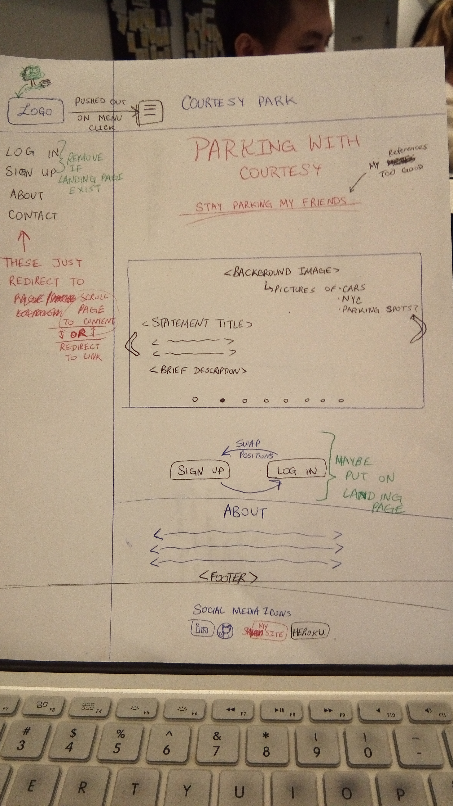
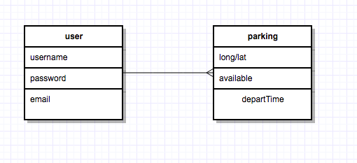

*** Syed W Shah / 10/27/17 ***

# Concept: Parking-App
# Title: Courtesy Park[ing]

Concept:
This app will allow users to park their vehicle and serve them a reminder
of where they parked with the description they've provided and a map view
of their vehicle's location. The 'courtesy' part comes in with the 
description users will provide, where they may detail information of when
they plan to leave the spot, so potential nearby drivers can just go to their
location rather than scouting for some free space.


Current Usage state:
-Don't forget to hit "Log Out" if you plan on using the page again.
-If you accidently did this, instead of registering again, you can simply 
append '/parking' to the URL after the '.com'


**A.** *Run Site Locally*
```
1. Make a clone of this repo
2. Launch terminal
3. Type in 'npm run dev' to start the server on port 3000
    -You can change the port if you like if you're using port
    3000 for something else. Simply edit server.js  
    ^--At a worst case scenario, you may also have to change
        the port in /db/config.js (which I cannot be too helpful with).
        You most likely won't have to worry about this.
4. Open up your browser and go to:
    http://localhost:3000/
5. If done correctly, you should be at the site, running locally.
```
*Note*: You may have to install all relevant dependancies. Refer to *D*

**B.** *Set up a database*
```
Just note that the database will have no database the first time you 
would run this locally. So you may have to do the following to set up
the database:
1. Launch Terminal
2. Create a psql database called 'parking_spots'
    Note: It can be named whatever you like.
    If you need help doing this, refer to (C.)
3. In terminal, go to the directory where migrations.sql resides on this
    repo. It should be under /db/migrations/ 
    
4. Then run the command:
    psql -d [the name of the database] -f migrations.sql
    ^This will create our database for both parking spots and users
5. Then run the command:
    psql -d [the name of the database] -f ../seeds/spots.sql
    ^This will create some sample values for our parking spots
```

**C.** *Create a database*
```
1. Launch Terminal
2. Run the command:
    createdb [your database name]
```

**D.** *Installing dependencies*
```
1. Launch Terminal
2. Go to the directory of where you have /.git 
    It should be in the root of /Parking-App
2. Run the command:
    npm install [dependency name]

For Step 2 Make sure you have the following (or later versions) in 
the package.json:

    "bcryptjs": "^2.4.3",
    "body-parser": "^1.18.2",
    "cookie-parser": "^1.4.3",
    "dotenv": "^4.0.0",
    "ejs": "^2.5.7",
    "express": "^4.16.2",
    "express-session": "^1.15.6",
    "mapbox-gl": "^0.41.0",
    "method-override": "^2.3.10",
    "morgan": "^1.9.0",
    "passport": "^0.4.0",
    "passport-local": "^1.0.0",
    "pg-promise": "^7.1.0"
```

## Wireframe





Specifics:
-Users can log in
-Geolocate current position, log it as as your parking spot
-Description of parking spot can be logged.
-Est. time of leaving spot

Database name: parking_app
tables used: 
-users 
-spots

NOTE: Changing migrations will require changing MODELS and CONTROLLERS as well.
-May need a changes on /seeds 
-May need to update views
-This is also important to keep in mind when we add in an API or User authentication.

NOTE 2: For when I want to redirect login/register to '/user' page 
-Change path for register in user.controller.js  .create() method
--set authRouter.post() to redirect to '/user' when successful.

## Phases of Completion

*Oct 31st, 2017 (11:07 pm):*
    Now there's two things I've realized today. IT'S HALLOWEEN?! Also I should
    have been updating here a bit more frequently. Regardless, my overall goal was to create
    an app which would alert people seeking parking spots when a spot would free up,
    but I realized the building block is to first create a way to log that someone parked
    in the first place. This part seems to be completed so far. But I feel I'm at a 
    good point to just make my pages look better, since they're were not much
    to look at prior to today. 
    I will say I am quite proud of how quickly I learned to use Bootstrap, I felt
    it always seemed like something scary to me until I just tried it out. I have to say
    it makes creating a front-end so much easier...

    This may be a long update, but wait, there's more!
    My current future plans include creating 'cards' which will nicely
    display parking information along with a nice, small map with relative
    information.

    Current problems that should be addressed in the future: There's currently
    no user-specific page. So far it's just a sort of login and use. Well you 
    don't even need to log in since I made the process simpler with the "Explore"
    button on the landing page. Yes, I am well aware this makes no sense in a real app,
    but it's just there since this is not a completed app and I feel users should be allowed
    to just access it asap to get the point for now. Maybe I will remove this in the
    near future when I want to add more robustness to this app.
    
    PRIORITY (in order):
    --Need to add a way to log out properly
    --Need to add microinteractions when hovering over navbar items
    --Need to make parking-index page prettier
    --Need to add a way to obtain current location's lat./long. values
    --Need to get lat./long. values of a given address
    --Set up users page
    --Create Cards

*Sept 1st, 2017 (12:22 pm):*
    I now have log out working mostly properly. If a user is already logged in,
    clicking 'log in' on the landing page should just move you to the home page.
    Instead the program throws an error saying something along "Already logged 
    in", but it should instead just let us get into the page. This should be a 
    quick fix, hopefully we fix this today. I commented out the 'Explore' 
    button on the landing page since its silly to have at this point. 

*Sept 1st, 2017 (04:34 pm):*
    So the current state of this project is quite a lot to mention, so I'll 
    mention the most important details. Currently the app is available on Heroku,
    however there's still some work to be done. 
    Currently all users would see the same page upon logging in, so in the
    future, I will need to create user specific pages, which will simply give 
    us security of our input and better track who input what. 

*Sept 1st, 2017 (05:15 pm):*
    So this app is currently a sort of "Free-For-AllTreasure Chest" in which 
    anyone can take and put in as they please. Although this problem can be 
    resolved, the purpose of this app was not to create a completely, fully
    functioning app, it was to learn Express. I feel I've satisfied my purpose.
    I'm going to move on to apsiring to master React, and then I can come back to
    this. 


-----------------------------------------------------------------------------------


LONG TERM GOALS:
    -User specific pages
    -Users may be reviewed, and earn 'courtesy points'. Who knows, maybe
    they can spend these courtesy points somehow, maybe use it as coupons
    or just show off that they're better than you when it comes to 
    courtesy or something... sure, lets go with that. 

## Links and Resources
(Anything you've looked up so far or are thinking about using.)
Might be using this as a guide to creating user authentication: 
https://scotch.io/tutorials/easy-node-authentication-setup-and-local
I'll update this readme if I do, which will be more likely than not.
^I ended up not using this, but I'll keep it here for my future self.

API USED:
MapBox: "An open source mapping platform for custom designed maps. Our APIs and SDKs are the building blocks to integrate location into any mobile or web app."
